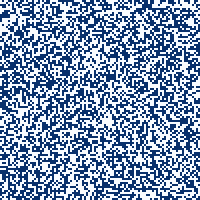

# Intro

- 👋 Hi, I am @Arthur-B, a PhD student in Material Science applying Machine Learning to develop nanomaterials with on demand properties.
- 👀 I am interested in Data Science, Machine Learning, and generative processes.
- 🌱 I am currently on a PyTorch deep dive, to apply some skills I learned during my PhD to new interesting problems. I am also learning Django and React to build some web app.
- 📫 You can reach me via [LinkedIn](https://www.linkedin.com/in/arthur-baucour/)

# Recent projects

## 📒 Experimental equipment logging platform 📒

### Django, React, Recharts

Based on my experience operating fabrication equipement during my PhD, I developed a single-page webapp to log experimental results and perform regression to help plan next experiments.
It is developed using Django for the backend, React for the frontend, and Recharts for the visualization.

Check out the repository: [`equipment-logging`](https://github.com/Arthur-B/equipment-logging)

 
 

  

## 🌱 Game of Life 🌱

### PyTorch

I have been working on a PyTorch implementation of [Conway's Game of Life](https://en.wikipedia.org/wiki/Conway%27s_Game_of_Life).
There are some nifty tricks to run the life simulation in parallel with minimal code thanks to convolutions and a simple neural network with fixed weights to perform logic operations.

Check out the repository: [`game-of-life`](https://github.com/Arthur-B/game-of-life)

 
 

## 🐍 Reinforcement learning snake 🐍

### PyTorch, Pygame

Inspired by ["Human-level control through deep reinforcement learning"](https://doi.org/10.1038/nature14236) (here is the accessible [ArXiv version](https://arxiv.org/abs/1312.5602)), I taught my little computer how to play snake.
I developed a game environment tailored to reinforcement learning and implemented DQN algorithm in PyTorch.
Look at him go!

Check out the repository: [`RL-snake`](https://github.com/Arthur-B/RL-snake)

 
 

  

## 🥧 Estimating Pi 🥧

### NumPy

Pi is an ubiquitous constant that can be estimated by various methods. Every year around Pi-day, pi visualizations, such as Monte-Carlo simulations (on the left), bloom over the internet. However, which one is it the fastest? Or the prettiest?! In this repository, I explore different ways to determine Pi, thei convergence speed, and their visualizations.

Check out the repository: [`pi-estimate`](https://github.com/Arthur-B/pi-estimate)

